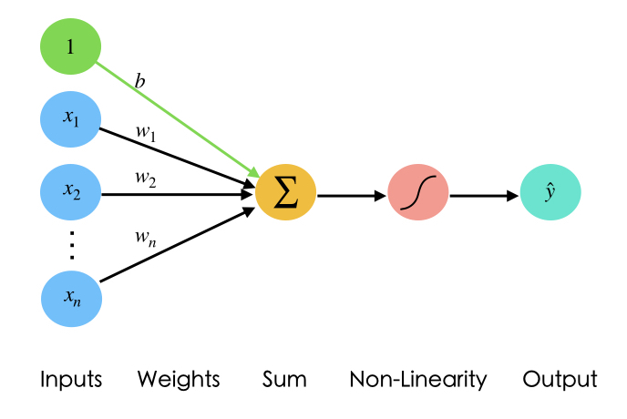
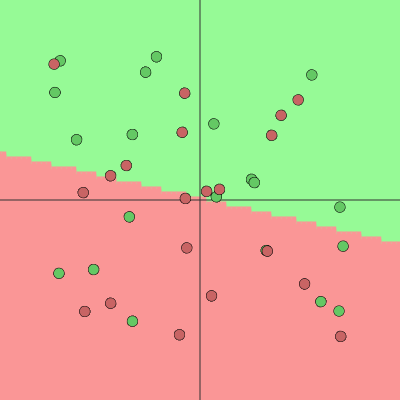
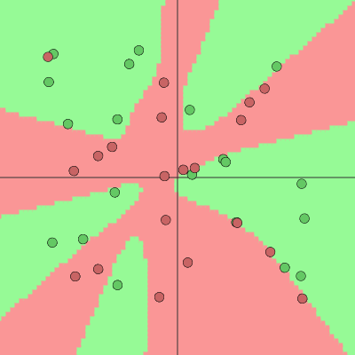
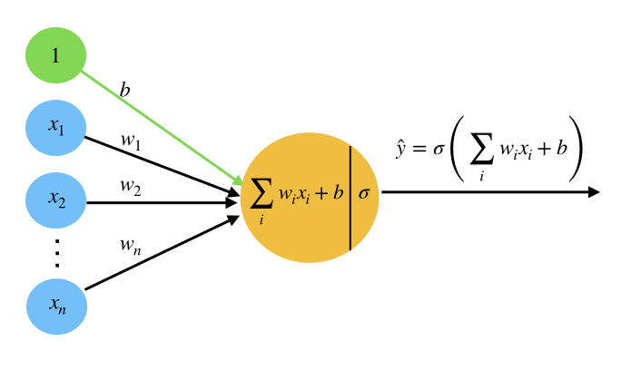
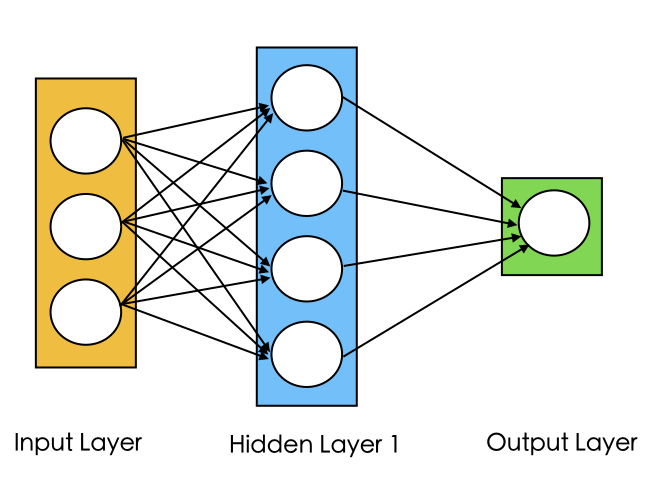
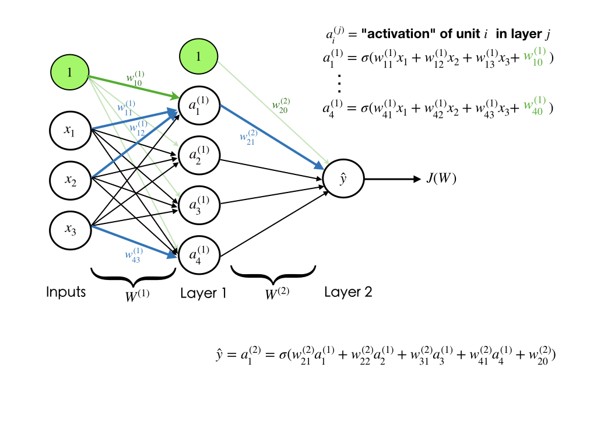
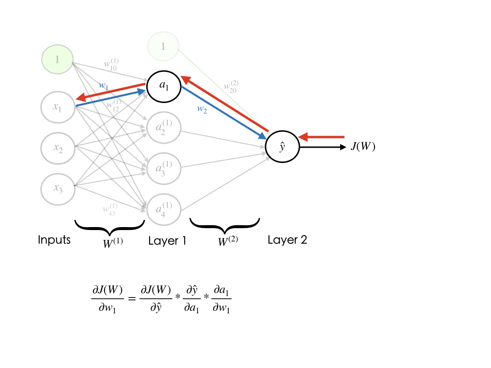

## Perceptron

Perceptron is a single neuron that calculates a linear combination of the input (i.e. performs a dot product with the input and its weights), adds a bias $b$, applies the non-linearity (or activation function), and outputs a value. If the activation function is sigmoid $\sigma$, the output is a number between 0 and 1.

$$\hat{y}=\sigma(b + \sum_{i=1}^n w_ix_i)$$

where $\sigma (t)=\frac{1}{1+e^{-t}}$


*Fig2. Representation of Perceptron*

## Common Activation Functions

1- **Sigmoid**. Sigmoid function takes a real-valued number and "squashes" it into range between 0 and 1. In particular, large negative numbers become 0 and large positive numbers become 1.

2- **Tanh**. Tanh function $tanh(x)=2\sigma(2x)-1$ squashes a real-valued number to the range [-1, 1]. Its output is zero-centered. Please note that the tanh neuron is simply a scaled sigmoid neuron.

3- **ReLU**. The Rectified Linear Unit has become very popular in the last few years. It computes the function $f(x)=max(0,x)$. In other words, the activation is simply thresholded at zero.

## Importance of Activation Functions

The purpose of activation functions is to introduce ***non-linearity*** into the network, which enables the network to separate the data that is not linearly separable. Linear functions always create linear decisions while non-linear functions allow to approximate arbitrarily complex functions.


*Fig3. Linear activation functions produce linear decisions*


*Fig4. Non-Linear activation functions produce non-linear decisions*

## Perceptron Simplified

We usually simplify the perceptron representation as below.


*Fig5. Simplified perceptron*

## Training a Neural Network

We will see how we can train a neural network through an example. Let's assume that our neural network architecture looks like the image shown below.




We can see that the weights $\mathbf{W}$ and biases $\mathbf{b}$ are the only variables that affect the output $\hat{y}$. Therefore, training a neural network essentially means finding the right values for the weights and biases so that they can determine the best predictions. In other words, the process of fine-tuning the weights and biases from the input data is called training neural network.

Training a neural network involves two steps:

  1- Feed-forward computation

  2- backpropagation

### Feed-forward computation

Feed-forward step fundamentally means *repeated matrix multiplications combined with activation function*. Considering our example network, we convert the different variables into vectors and matrices. Therefore, the input  would be a [3x1] vector. The weights of the first hidden layer `W1` would be a [4x3] matrix, and its biases `b1` would be a [4x1] vector. In this layer, each neuron has its weights in a row of `W1`, so the matrix vector multiplication `np.dot(W1,x)` evaluates the activations of all neurons in this layer. For the last layer (output layer), `W2` and `b2` would be of size [1x4] and [1x1], respectively. The full forward pass of this 3-layer neural network is then simply three matrix multiplications, merged with the application of the activation function:



``` python
# forward-pass of a 2-layer neural network:
f = lambda x: 1/(1 + np.exp(-x)) # activation function (use sigmoid)
x = np.random.randn(3, 1) # random input vector of three numbers (3x1)
h1 = f(np.dot(W1, x) + b1) # calculate first hidden layer activations (4x1)
out = f(np.dot(W2, h1) + b2) # output neuron (1x1)
```

We need to learn the Parameters `W1,W2,b1,b2` of the above network. Please note that the input `x` could be an entire batch of training data, where each example would be a column of `x`.

> Note: The forward pass of a fully-connected layer corresponds to one matrix multiplication followed by a bias offset and an activation function.

### Loss Function

performing a forward-pass of the network gives us the predictions. Therefore, we must evaluate the "goodness" of our predictions, which means we need to measure how far off our predictions are. **Loss function** enables us to do that. The loss function measures the cost caused by incorrect predictions.

if $\mathcal{L}(\hat{y}^{(i)},y^{(i)})$ is the loss of each example $i$ in the training set, for $i=1,2,\cdots,m$, then total loss $J(\mathbf{W})$ over the entire dataset is:

$$J(\mathbf{W})=\frac{1}{m}\sum_{i=1}^m \mathcal{L}(\hat{y}^{(i)},y^{(i)})$$

Please note that $\mathbf{W}=[\mathbf{W}^{(1)}, \mathbf{W}^{(2)},\cdots, \mathbf{W}^{(n)}]$, where $\mathbf{W}^{(j)}$ is matrix of weights of layer $j$

### Cross Entropy Loss

Cross entropy loss is used in classification problems and outputs a probability between 0 and 0.

$$J(\mathbf{W})=\frac{1}{m}\sum_{i=1}^m \left[ y^{(i)}\log(\hat{y}^{(i)}) + (1-y^{(i)})\log(1-\hat{y}^{(i)})\right]$$

### Mean Squared Error Loss

Mean squared error loss is used in regression problems and outputs a real-valued number.

$$J(\mathbf{W})=\frac{1}{m}\sum_{i=1}^m \left( y^{(i)} - \hat{y}^{(i)} \right)^2$$

### Backpropagation

Our goal in training is to find the weights and biases that minimizes the loss function:

$$\mathbf{W}^* = \underset{\mathbf{W}}{\arg\min}\ J(\mathbf{W})$$

After we measured the loss, we need to find a way to **propagate** the error back, and update our weights and biases, in order to decrease the loss. But how much should we adjust the weights and biases.

In order to find the appropriate amount of change in the weights and biases, we need to take the derivative of the loss function with respect to the weights and biases. The process of computing gradients of expressions through recursive application of chain rule is called **backpropagation**. When we have the gradients, we can use the *gradient descent* algorithm to update the weights.

Gradient descent algorithm:
1. Initialize the weights randomly $\sim N(0,\sigma^2)$
2. Loop until convergence:
   1. Compute gradient, $\frac{\partial J(\mathbf{W})}{\partial \mathbf{W}}$
   2. Update weights, $\mathbf{W} = \mathbf{W}-\eta \frac{\partial J(\mathbf{W})}{\partial \mathbf{W}}$
3. Return weights

For instance, if we are going to compute the gradient with respect to $w_1$, in our example network below, we have:


We need to repeat this **for every weight in the network** using gradients from later layers.


